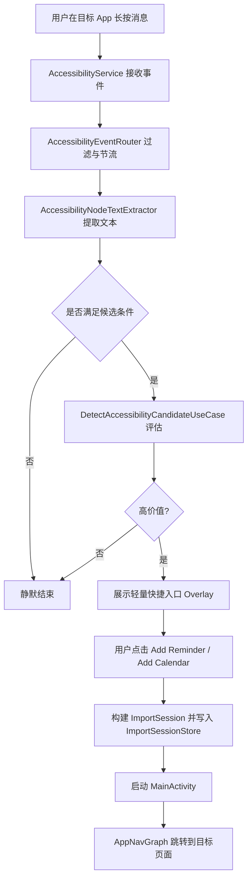
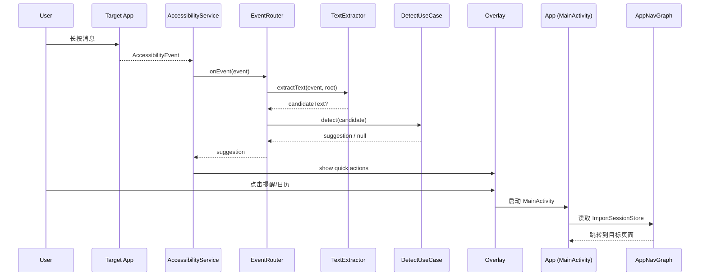

# Milestone 6 可视化说明文档

以下为辅助功能入口 PoC 的可视化流程说明，便于团队理解整体链路与交互位置。

## 1. 总体流程（可视化流程图）

## 2. 事件链路时序图

## 3. 关键模块与职责

- `ReminderAccessibilityService`：接收 Accessibility 事件并触发入口
- `AccessibilityEventRouter`：节流、目标应用识别、候选提取
- `AccessibilityNodeTextExtractor`：候选文本提取
- `DetectAccessibilityCandidateUseCase`：价值判断与冷却策略
- `AccessibilityOverlayController`：轻量入口 UI
- `AccessibilityImportBridge`：构建 ImportSession 并进入 App

